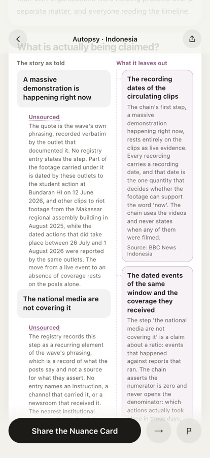
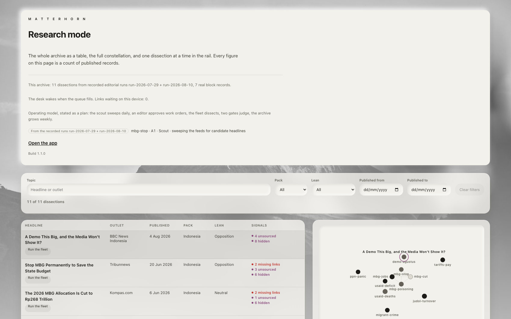
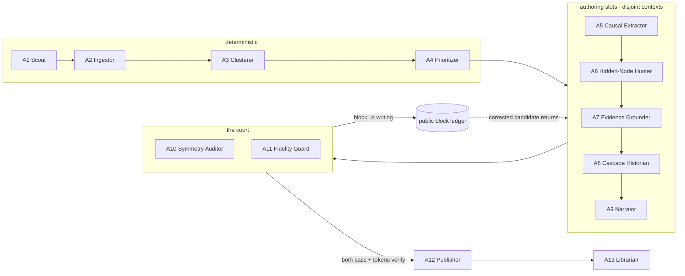

<div align="center">

# Matterhorn

**A verdict-free causal literacy engine. You stay the judge.**

[](https://github.com/Finerium/matterhorn/actions/workflows/ci.yml)
[](https://matterhorn-app.vercel.app)
[](#the-read-path-is-static)
[](#the-archive-all-eleven)
[](#license)

<em>Most people see the peak. Matterhorn shows the climb.</em>

</div>

Matterhorn dissects viral news narratives whose individual facts all check out and whose
causal claims are never established. Given a narrative it renders the causal skeleton the
story implies: the asserted spine, every link labelled by evidence status, and beside it the
branches the story priced at zero — the absent denominator, the missing counterfactual, who
bears the cost first. Every number on screen carries a source identifier that resolves in
[`content/sources.json`](content/sources.json), or the renderer throws instead of drawing it.
The product never says true or false and never scores an outlet.

> **Its honesty is enforced by machines, against its own makers.** Two gate agents with the
> power to refuse publication blocked five of the archive's eleven dissections before they
> shipped — seven written refusals in all, and every one is a
> [public record in this repository](pipeline/runs/run-2026-07-29/blocked/).

**TL;DR.**

- A **thirteen-agent editorial fleet** produces each dissection at editorial time: six
  deterministic stages, seven language-model slots with disjoint contexts, two of them judges
  that can and do say no.
- The archive holds **11 dissections** in two packs (7 Indonesian, 4 global-English), **48
  verified sources**, **147 sourced figures, zero without a source**.
- The **read path is static**: no server, no key, no model call, no tracking. What a reader
  opens is a sealed, fingerprinted file.
- Both editorial runs are **recorded and replayable** in the product itself, refusals
  included, with a disclosure line pinned on screen.
- Built for the **UNESCO Youth Hackathon 2026** (AI × media and information literacy track).

---

## The problem it answers

In late July 2026, old protest clips circulated in Indonesia as a demonstration happening
*now*, under one line: **"A demo this big, and the media won't show it?"** Run it through a
fact-check and nothing snags — the clips are real recordings; outlets dated part of the
footage to 12 June 2026 and other clips to August 2025. The persuasion lives in the arrow:
*the demonstration is happening, the media are silent, so the silence is deliberate.*

Monash University Indonesia counted about 197,000 posts from 63,000 accounts across five
platforms in a week; of 34,935 posts analysed on X, 99.46 percent were retweets, and one post
carried 13,446 of them. The chain's last step asks readers to repost — so compliance adds to
the volume its first step reads back as proof of the event.

This story is a trap for source-checking itself: once you believe the media are silenced, the
*absence* of coverage becomes the evidence. What still works is reading the structure, and
that is what Matterhorn asks before it reveals anything:

> **What is the mechanism? Compared to what? Who pays first?**

The app asks those three questions, grades nothing, and then shows the published analysis
beside the reader's own answers. The reader stays the judge.
[This dissection is live](https://matterhorn-app.vercel.app/n/demo-agustus), in Indonesian
and English, with every figure sourced.

## See it live

| URL | What it is |
|---|---|
| [matterhorn-app.vercel.app](https://matterhorn-app.vercel.app) | scroll-driven landing: the problem, the fleet, the grammar |
| [/app](https://matterhorn-app.vercel.app/app) | the mobile PWA (framed on desktop); installs, shares in, works offline |
| [/n/demo-agustus](https://matterhorn-app.vercel.app/n/demo-agustus) | the flagship dissection as a public permalink |
| [/research](https://matterhorn-app.vercel.app/research) | desktop research desk: archive table, constellation, exports, the replay console |
| [/methodology](https://matterhorn-app.vercel.app/methodology) | the product reporting on itself: "5 of 11, across 7 block(s)" |

**Five-minute tour.** Open `/research` on a laptop → press *Run the fleet* on
`demo-agustus` and watch the recorded August run replay, both judges passing first round →
replay `judol-turnover`'s July run and watch the symmetry gate refuse it, twice, in writing →
scan the QR at the publish moment and the dissection opens on your phone → on the phone, open
Methodology and read the product's own refusal count.

<p align="center">
  
  
  
</p>

## The fleet

Thirteen agents, one narrow job each. Six are deterministic code; seven are language-model
slots with deliberately disjoint contexts, so no agent can lean on another's reasoning.
Prompts live in [`pipeline/agents/prompts/`](pipeline/agents/prompts/), the model floor per
slot in [`pipeline/config.ts`](pipeline/config.ts).

| Agent | Role | Kind |
|---|---|---|
| A1 Scout | reads the frozen snapshot registry | deterministic |
| A2 Ingestor | normalises the raw material | deterministic |
| A3 Clusterer | groups one story | deterministic |
| A4 Prioritizer | ranks the families | deterministic |
| A5 Causal Extractor | maps the asserted chain | claude-fable-5 |
| A6 Hidden-Node Hunter | hunts what the chain needs but never states | claude-fable-5 |
| A7 Evidence Grounder | the only agent permitted to mint a number, constrained to the source registry | claude-opus-5 |
| A8 Cascade Historian | how waves like this one ran before | claude-opus-5 |
| A9 Narrator | two languages, verdict-free register | claude-opus-5 |
| A10 Symmetry Auditor | *judge*: would the mirror framing get the same rigor? | claude-fable-5 |
| A11 Fidelity Guard | *judge*: every narration sentence walked back to its element | claude-opus-5 |
| A12 Publisher | refuses to write unless both verdicts pass and both fingerprints match | deterministic |
| A13 Librarian | files the archive, aggregates cross-run methodology | deterministic |



Two rules the rest of the build leans on:

- **The judges' word is not taken.** A10 and A11 return judgments; the *runner* mints each
  gate token as a sha256 over the exact candidate bytes. A12 publishes nothing unless both
  verdicts read pass and both tokens verify against the exact bytes it is about to write.
- **A block binds the bytes it judged.** A superseded candidate is named in the log and the
  same bytes are refused forever. The publisher reads no clock, so two runs over the same
  inputs are byte-identical.

## The archive, all eleven

Per-dissection gate record, from the committed run ledger. Every refusal links to the actual
block record with the judge's written reasons.

| Dissection | Pack | Gate record |
|---|---|---|
| demo-agustus | ID | passed first round ([run-2026-08-10](pipeline/runs/run-2026-08-10/)) |
| mbg-stop | ID | [blocked ×1](pipeline/runs/run-2026-07-29/blocked/mbg-stop-A11-1.json), then passed |
| mbg-cut | ID | passed first round |
| mbg-poisoning | ID | [blocked ×1](pipeline/runs/run-2026-07-29/blocked/mbg-poisoning-A11-1.json), then passed |
| mbg-jobs | ID | passed first round |
| judol-turnover | ID | blocked [×1](pipeline/runs/run-2026-07-29/blocked/judol-turnover-A10-1.json) [×2](pipeline/runs/run-2026-07-29/blocked/judol-turnover-A10-2.json), then passed |
| ppn-panic | ID | passed first round |
| tariffs-pay | EN | [blocked ×1](pipeline/runs/run-2026-07-29/blocked/tariffs-pay-A11-1.json), then passed |
| usaid-deficit | EN | blocked [×1](pipeline/runs/run-2026-07-29/blocked/usaid-deficit-A10-1.json) [×2](pipeline/runs/run-2026-07-29/blocked/usaid-deficit-A11-1.json), then passed |
| migrant-crime | EN | passed first round |
| usaid-deaths | EN | passed first round |

The runs themselves are committed under [`pipeline/runs/`](pipeline/runs/): agent inputs,
judged candidates, verdicts, block records, and the publish log for both recorded fleets
(July and August 2026).

## What this build is, precisely

An archive of eleven narratives, seven in an Indonesia pack and four in an EN-Global pack,
each dissected once at editorial time by the fleet and published as static JSON under
[`content/`](content/). The app fetches those artifacts over HTTP and renders them. That is
the entire read path.

<a name="the-read-path-is-static"></a>

- **Nothing is analysed when you open the site.** No backend, no serverless function, no API
  endpoint, no model call at runtime, no tracking.
- **The repo holds no API key and no `.env` file**, and the shipped app reads no environment
  variable. CI's secret scan covers the full git history. `pipeline/config.ts` declares a
  typed `api` executor that is deliberately not wired and refuses if it is selected.
- **Pasting a link does not conjure an analysis.** Links resolve against
  `content/url_index.json`; a miss renders an honest queue state rather than inventing one.
- **Link previews are honest.** A cached og:image renders only with the outlet's name and an
  outbound link; where an outlet blocks fetching or serves a generic logo, the neutral
  placeholder ships and [`content/og_attribution.json`](content/og_attribution.json) records
  the failure with its reason.
- **Every published artifact carries its own manifest**: which model ran which slot, when,
  over what input hash, plus both gate verdicts and their tokens.
- The narration register is enforced by contract: a
  [banned-verdict lexicon](contracts/) lints every string in both languages — the product
  cannot say "hoax", "false", "debunked" in its own voice, in any language it ships.

## Verify the claims

Nothing here is claimed without a path or a command that proves it.

| Claim | Where to check |
|---|---|
| 5 of 11 dissections refused, 7 blocks | [`pipeline/runs/run-2026-07-29/blocked/`](pipeline/runs/run-2026-07-29/blocked/) + the live [methodology page](https://matterhorn-app.vercel.app/methodology) |
| 48 sources, verified live, with caveats | [`content/sources.json`](content/sources.json) |
| Zero numbers without a source | `pnpm validate:content` — ten checks, run on every invocation, no override switch |
| Byte-identical republish | [`scripts/`](scripts/) + the publisher's no-clock rule, [`ARCHITECTURE.md`](ARCHITECTURE.md) |
| Recorded runs replay in the product | [`content/replay.json`](content/replay.json), protocol in [`docs/replay-protocol.md`](docs/replay-protocol.md) |
| Suite results per acceptance gate | [`Report.md`](Report.md) — unit, grammar, app, pipeline, landing and motion suites with counts, plus Lighthouse and bundle budgets |
| Decisions, defects, deviations | [`.crown/notes.md`](.crown/notes.md) — the honest build log |
| The editorial sheet an operator signs | [`content-review.md`](content-review.md) |

## Architecture

Three planes, one honest boundary ([`ARCHITECTURE.md`](ARCHITECTURE.md) has the full
treatment):

- **Build plane** — the thirteen-stage pipeline under [`pipeline/`](pipeline/), driven one
  stage at a time; models run here and only here.
- **Content plane** — the published archive under [`content/`](content/): sealed JSON,
  validated by ten checks from the blueprint, frozen contracts in
  [`contracts/`](contracts/) that both content and code validate against.
- **Read plane** — a static SPA ([`app/`](app/)): landing, mobile PWA, permalinks, research
  desk, methodology. CSP is `script-src 'self'`; no third-party runtime script anywhere.

Routes, all client-side except the permalink shells (`app/src/routes.tsx`):

| Route | What it is |
|---|---|
| `/` | scroll-driven landing |
| `/app` | the mobile app shell; inside a phone frame at 768px and up |
| `/n/{id}` | public permalink, mounts the app straight onto that autopsy |
| `/research` | desktop research desk: archive table, constellation, exports, replay |
| `/methodology` | the published methodology, same body the in-app screen draws |
| `/share` | Android Web Share Target, resolves the incoming link |
| `/offline` | what the service worker serves for an uncached navigation |

## Run it locally

Node 22 or newer, and pnpm (the repo pins `pnpm@10.33.2` via `packageManager`).

```bash
pnpm install
pnpm dev          # vite dev server, http://127.0.0.1:5173
```

The dev server reads the published archive itself. To serve the real build:

```bash
pnpm build
rm -rf app/dist/content && cp -R content app/dist/content
pnpm preview      # http://127.0.0.1:4173
```

## Regenerate the content

Content is not generated by `pnpm build`. It is produced by the thirteen-stage pipeline,
driven one stage at a time:

```bash
pnpm pipeline stage <A1..A13> --run <run dir> [--narrative <id>] [--out <content root>]
```

`--run` is the only place a stage reads and writes state; `--out` keeps a dry run from
publishing into `content/`. Six stages are deterministic and run to completion in the runner.
The seven LLM slots are **not** executed by the runner: under the shipping `claude-code`
executor the runner stages `<run>/slots/<narrative>/<role>.input.json`, an orchestrating
agent session runs that slot, and the next invocation of the same stage validates the staged
output against `pipeline/agents/<role>.schema.json` and ingests it. Regenerating content is
an orchestrated editorial session, not one command — by design, and recorded in the run log.

After a run, the archive has to pass the validator before it means anything:

```bash
pnpm validate:content   # ten checks, from schema to source liveness, never touches the network
```

## Checks

```bash
pnpm lint            # eslint
pnpm typecheck       # tsc --noEmit
pnpm test:unit       # vitest, the app and validator suites
pnpm test:pipeline   # vitest, pipeline unit tests and evals
pnpm test:e2e        # playwright, the state matrix and reader flows
pnpm validate:content
```

CI ([`.github/workflows/ci.yml`](.github/workflows/ci.yml)) runs lint, typecheck,
`test:unit`, `validate:content` and `build` on every push; every step is blocking. The e2e
suite and pipeline evals run outside CI, recorded as a gap in `.crown/notes.md`.

## Honest limits

The product states its own limits on a dedicated page, and so does this repository:

- **Structure is not truth.** A clean dissection is not an endorsement, and an `unsourced`
  label is not a verdict of false; the register bans verdict words in both directions and the
  residue is stated, not cured.
- **No effect size of any kind has been measured.** The Sparring instrument defines two
  metrics by construction; first supervised sessions are planned around Global MIL Week 2026,
  with results published whichever way they point.
- **The run log keeps its deviations.** One judging slot ran on the second model tier when
  the mandated tier hit its account limit — written into the run log rather than absorbed.
  The story-grouping stage measures poorly and ships its measurement.
- Coordination in the flagship case is the Monash researchers' **attributed suspicion**,
  never this product's finding; no actor is accused in the artifact's voice.

## AI disclosure

Matterhorn is AI on both sides of its own sentence: an agent fleet is the analytic
instrument, and AI-era manipulation is the object of study. The editorial slots run on
`claude-fable-5` and `claude-opus-5` (floor per slot in
[`pipeline/config.ts`](pipeline/config.ts)); the orchestrating executor is Claude Code, per
the committed ADRs. The judges share a model family with the writers — independence is
structural, not vendor-level: frozen judge instructions, disjoint contexts, and public
receipts that let anyone contest and re-run a symmetry call. The application code was built
with Claude Code as well, and the build log ([`.crown/notes.md`](.crown/notes.md)) keeps the
failures alongside the wins.

## Team

Built by **Ghaisan Khoirul Badruzaman** and **Kesya Austin** for the UNESCO Youth Hackathon
2026.

Contact: [ghaisan.khoirul.b@gmail.com](mailto:ghaisan.khoirul.b@gmail.com) ·
[kesyaaustin6@gmail.com](mailto:kesyaaustin6@gmail.com)

## License

© 2026 Ghaisan Khoirul Badruzaman & Kesya Austin. The source is published for verification —
so that every claim in the UNESCO proposal, the product, and this README can be checked from
a browser — and remains all rights reserved. Third-party assets are inventoried per file in
[`LICENSES.md`](LICENSES.md); the news material inside the archive is quoted and attributed
under the dissections' source registry, and cached link previews render only with outlet
attribution.

## Read next

- [`ARCHITECTURE.md`](ARCHITECTURE.md) — the planes, the pipeline DAG, why each dependency is there.
- [`RUNBOOK.md`](RUNBOOK.md) — operator procedures: add a narrative, re-run the pipeline, publish a correction.
- [`docs/understanding.md`](docs/understanding.md) — the comprehension document: the core idea, the four blindnesses, the verdict-free rules.
- [`Report.md`](Report.md) — the honest story of the build, evidence-mapped.
- [`CHANGELOG.md`](CHANGELOG.md) — 1.0.0 → 1.1.0, including the second recorded run.
